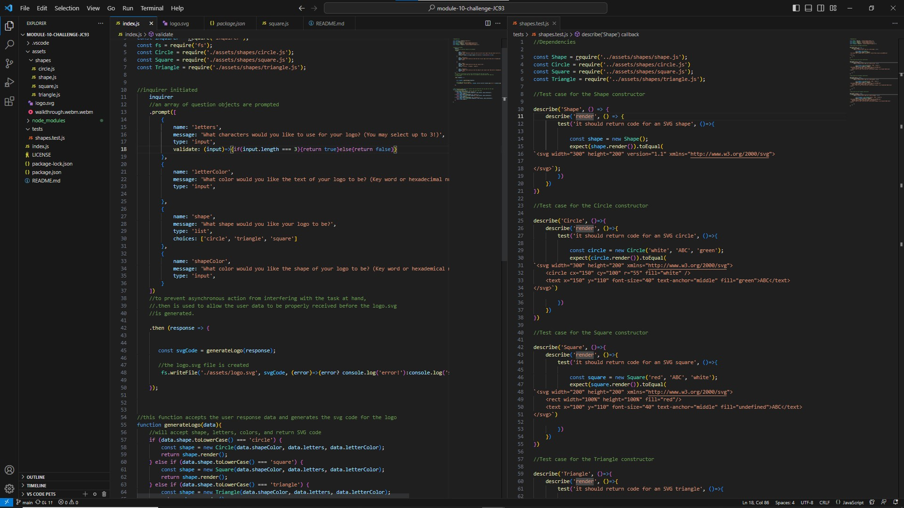

# module-10-challenge - logo.svg Generator

## Technology Used 

| Technology Used         | Resource URL           | 
| ------------- |:-------------:| 
| HTML    | [https://developer.mozilla.org/en-US/docs/Web/HTML](https://developer.mozilla.org/en-US/docs/Web/HTML) | 
| Javascript     | [https://developer.mozilla.org/en-US/docs/Web/Javascript](https://developer.mozilla.org/en-US/docs/Web/JavaScript)      |   
| Git | [https://github.com/](https://github.com/)     |    
| Node     | [https://developer.mozilla.org/en-US/docs/Web/Javascript](https://nodejs.org/docs/latest-v20.x/api/)

## Description

We were asked to develop an application that can be run through the terminal/command line to create a logo.svg. 

## Usage

1. run ~$ node index.js from the root directory
2. Answer prompts
3. The logo.svg will appear in assets folder. 

## User Story

AS a freelance web developer
I WANT to generate a simple logo for my projects
SO THAT I don't have to pay a graphic designer

## Acceptance Criteria

GIVEN a command-line application that accepts user input
WHEN I am prompted for text
THEN I can enter up to three characters
WHEN I am prompted for the text color
THEN I can enter a color keyword (OR a hexadecimal number)
WHEN I am prompted for a shape
THEN I am presented with a list of shapes to choose from: circle, triangle, and square
WHEN I am prompted for the shape's color
THEN I can enter a color keyword (OR a hexadecimal number)
WHEN I have entered input for all the prompts

THEN an SVG file is created named `logo.svg`
AND the output text "Generated logo.svg" is printed in the command line
WHEN I open the `logo.svg` file in a browser
THEN I am shown a 300x200 pixel image that matches the criteria I entered

## Learning Points 

The purpose of this challenge was to practice using the fs, inquirer and jest node modules, and to showcase our understanding of class constructors, inheritance, svg, as well as the writing and implentation of test cases. 

## My Info

* [LinkedIn](https://linkedin.com/in/justinchoica)
* [Github](https://github.com/justinschoi93)
* [Email](justinschoi93@gmail.com)
